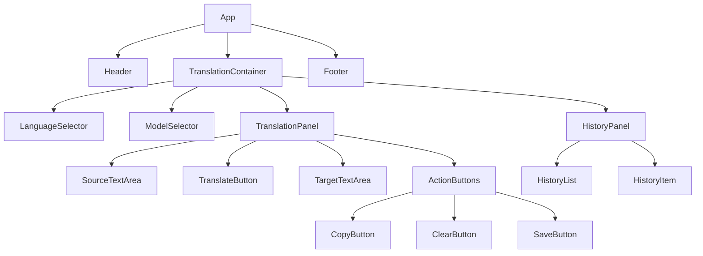
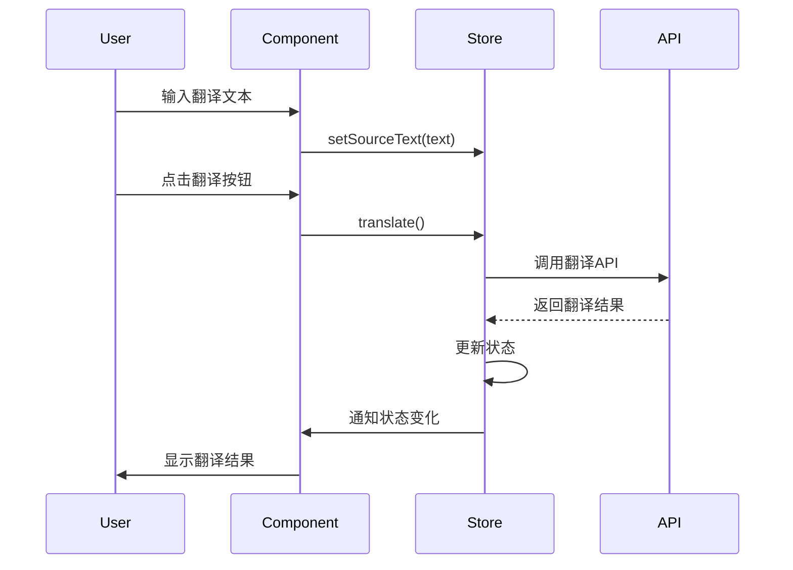
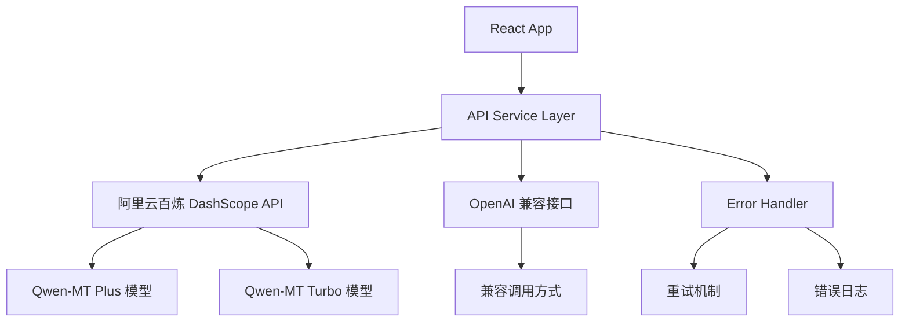

# Qwen-MT 翻译网站设计文档

## 1. Overview

基于 Qwen-MT 模型的翻译网站，为用户提供便捷的多语言翻译服务。用户可以选择不同的语言对和模型版本，实现高质量的文本翻译功能。

### 核心功能
- 多语言翻译支持
- 多模型选择
- 实时翻译
- 翻译历史记录
- 响应式设计

### 目标用户
- 需要多语言翻译服务的个人用户
- 学习外语的用户
- 进行国际业务的专业人士

## 2. Technology Stack & Dependencies

### 前端技术栈
- **框架**: React 18+ 
- **开发工具**: Vite
- **样式**: Tailwind CSS
- **状态管理**: Zustand
- **HTTP 客户端**: Axios
- **UI 组件**: Headless UI
- **图标**: Heroicons
- **类型检查**: TypeScript

### 后端/API
- **翻译API**: Qwen-MT API
- **可选**: 自建 API Gateway (Express.js/Node.js)

## 3. Component Architecture

### 3.1 Component Definition



### 3.2 Component Hierarchy

#### 核心组件层次结构

| 组件 | 父组件 | 子组件 | 功能描述 |
|------|--------|--------|----------|
| App | - | Header, TranslationContainer, Footer | 应用根组件 |
| Header | App | Logo, Navigation, ThemeToggle | 页面头部 |
| TranslationContainer | App | LanguageSelector, ModelSelector, TranslationPanel, HistoryPanel | 翻译功能容器 |
| LanguageSelector | TranslationContainer | LanguageDropdown | 语言选择器 |
| ModelSelector | TranslationContainer | ModelDropdown | 模型选择器 |
| TranslationPanel | TranslationContainer | SourceTextArea, TranslateButton, TargetTextArea, ActionButtons | 翻译面板 |
| HistoryPanel | TranslationContainer | HistoryList | 历史记录面板 |

### 3.3 Props/State Management

#### TranslationContainer State

```typescript
interface TranslationState {
  sourceLanguage: string
  targetLanguage: string
  selectedModel: string
  sourceText: string
  translatedText: string
  isTranslating: boolean
  history: TranslationRecord[]
  error: string | null
}

interface TranslationRecord {
  id: string
  sourceText: string
  translatedText: string
  sourceLanguage: string
  targetLanguage: string
  model: string
  timestamp: Date
}
```

#### 主要组件 Props

```typescript
// LanguageSelector Props
interface LanguageSelectorProps {
  sourceLanguage: string
  targetLanguage: string
  onSourceLanguageChange: (language: string) => void
  onTargetLanguageChange: (language: string) => void
  onSwapLanguages: () => void
}

// ModelSelector Props
interface ModelSelectorProps {
  selectedModel: string
  availableModels: Model[]
  onModelChange: (model: string) => void
}

// TranslationPanel Props
interface TranslationPanelProps {
  sourceText: string
  translatedText: string
  isTranslating: boolean
  onSourceTextChange: (text: string) => void
  onTranslate: () => void
  onClear: () => void
}
```

### 3.4 Example of Component Usage

```tsx
// TranslationContainer 组件使用示例
const TranslationContainer: React.FC = () => {
  const {
    sourceLanguage,
    targetLanguage,
    selectedModel,
    sourceText,
    translatedText,
    isTranslating,
    setSourceLanguage,
    setTargetLanguage,
    setSelectedModel,
    setSourceText,
    translate,
    clearTranslation
  } = useTranslationStore()

  return (
    <div className="max-w-6xl mx-auto p-6 space-y-6">
      <div className="flex gap-4">
        <LanguageSelector
          sourceLanguage={sourceLanguage}
          targetLanguage={targetLanguage}
          onSourceLanguageChange={setSourceLanguage}
          onTargetLanguageChange={setTargetLanguage}
        />
        <ModelSelector
          selectedModel={selectedModel}
          onModelChange={setSelectedModel}
        />
      </div>
      
      <TranslationPanel
        sourceText={sourceText}
        translatedText={translatedText}
        isTranslating={isTranslating}
        onSourceTextChange={setSourceText}
        onTranslate={translate}
        onClear={clearTranslation}
      />
      
      <HistoryPanel />
    </div>
  )
}
```

## 4. Routing & Navigation

### 4.1 路由结构

```mermaid
graph LR
    A[/] --> B[HomePage]
    A --> C[/translate] --> D[TranslationPage]
    A --> E[/history] --> F[HistoryPage]
    A --> G[/settings] --> H[SettingsPage]
    A --> I[/about] --> J[AboutPage]
```

### 4.2 路由配置

| 路径 | 组件 | 描述 | 权限 |
|------|------|------|------|
| `/` | HomePage | 首页，包含翻译功能 | 公开 |
| `/translate` | TranslationPage | 专门的翻译页面 | 公开 |
| `/history` | HistoryPage | 翻译历史记录 | 公开 |
| `/settings` | SettingsPage | 用户设置 | 公开 |
| `/about` | AboutPage | 关于页面 | 公开 |

## 5. Styling Strategy

### 5.1 设计系统

#### 颜色方案
```css
:root {
  /* Primary Colors */
  --color-primary-50: #eff6ff;
  --color-primary-500: #3b82f6;
  --color-primary-600: #2563eb;
  --color-primary-700: #1d4ed8;
  
  /* Neutral Colors */
  --color-gray-50: #f9fafb;
  --color-gray-100: #f3f4f6;
  --color-gray-500: #6b7280;
  --color-gray-900: #111827;
  
  /* Success/Error */
  --color-green-500: #10b981;
  --color-red-500: #ef4444;
}
```

#### 字体规范
```css
/* Typography Scale */
.text-xs { font-size: 0.75rem; }
.text-sm { font-size: 0.875rem; }
.text-base { font-size: 1rem; }
.text-lg { font-size: 1.125rem; }
.text-xl { font-size: 1.25rem; }
.text-2xl { font-size: 1.5rem; }
.text-3xl { font-size: 1.875rem; }
```

#### 间距系统
```css
/* Spacing Scale */
.space-1 { margin/padding: 0.25rem; }
.space-2 { margin/padding: 0.5rem; }
.space-4 { margin/padding: 1rem; }
.space-6 { margin/padding: 1.5rem; }
.space-8 { margin/padding: 2rem; }
```

### 5.2 组件样式策略

#### 按钮样式
```css
/* Primary Button */
.btn-primary {
  @apply bg-blue-600 hover:bg-blue-700 text-white font-medium py-2 px-4 rounded-lg transition-colors;
}

/* Secondary Button */
.btn-secondary {
  @apply bg-gray-200 hover:bg-gray-300 text-gray-900 font-medium py-2 px-4 rounded-lg transition-colors;
}
```

#### 输入框样式
```css
.input-field {
  @apply w-full px-3 py-2 border border-gray-300 rounded-lg focus:ring-2 focus:ring-blue-500 focus:border-transparent;
}

.textarea-field {
  @apply w-full px-3 py-2 border border-gray-300 rounded-lg focus:ring-2 focus:ring-blue-500 focus:border-transparent resize-none;
}
```

### 5.3 响应式设计

```css
/* Mobile First Approach */
.translation-container {
  @apply w-full p-4;
}

@media (min-width: 768px) {
  .translation-container {
    @apply p-6;
  }
}

@media (min-width: 1024px) {
  .translation-container {
    @apply max-w-6xl mx-auto p-8;
  }
}
```

## 6. State Management

### 6.1 Zustand Store 架构

```typescript
// stores/translationStore.ts
interface TranslationStore {
  // State
  sourceLanguage: string
  targetLanguage: string
  selectedModel: string
  sourceText: string
  translatedText: string
  isTranslating: boolean
  history: TranslationRecord[]
  error: string | null
  
  // Actions
  setSourceLanguage: (language: string) => void
  setTargetLanguage: (language: string) => void
  setSelectedModel: (model: string) => void
  setSourceText: (text: string) => void
  translate: () => Promise<void>
  clearTranslation: () => void
  swapLanguages: () => void
  addToHistory: (record: TranslationRecord) => void
  clearHistory: () => void
  removeFromHistory: (id: string) => void
}
```

### 6.2 状态管理流程



### 6.3 本地存储集成

```typescript
// 持久化历史记录
const useTranslationStore = create<TranslationStore>()(
  persist(
    (set, get) => ({
      // ... store implementation
    }),
    {
      name: 'qwen-translation-storage',
      partialize: (state) => ({ 
        history: state.history,
        selectedModel: state.selectedModel,
        sourceLanguage: state.sourceLanguage,
        targetLanguage: state.targetLanguage
      })
    }
  )
)
```

## 7. API Integration Layer

### 7.1 API 服务架构



### 7.2 API 接口定义

```typescript
// services/qwenTranslationAPI.ts

// 翻译请求参数 (基于阿里云百炼 API)
interface QwenTranslationRequest {
  model: 'qwen-mt-plus' | 'qwen-mt-turbo'
  messages: {
    role: 'user'
    content: string
  }[]
  translation_options: {
    source_lang: string // 支持 'auto' 自动检测
    target_lang: string
  }
  stream?: boolean
}

// 翻译响应结果
interface QwenTranslationResponse {
  id: string
  object: string
  created: number
  model: string
  choices: {
    index: number
    message: {
      role: string
      content: string
    }
    finish_reason: string
  }[]
  usage: {
    prompt_tokens: number
    completion_tokens: number
    total_tokens: number
  }
}

// 支持的模型信息
interface ModelInfo {
  id: 'qwen-mt-plus' | 'qwen-mt-turbo'
  name: string
  description: string
  context_length: number
  max_input: number
  max_output: number
  input_cost_per_1k: number // 每千token成本
  output_cost_per_1k: number
  supported_languages: string[]
}

// 支持的语言列表 (92种语言)
const SUPPORTED_LANGUAGES = [
  'Chinese', 'English', 'Japanese', 'Korean', 'French', 'Spanish', 
  'German', 'Thai', 'Indonesian', 'Vietnamese', 'Arabic', 'Portuguese',
  'Russian', 'Italian', 'Dutch', 'Turkish', 'Hindi', 'Bengali',
  // ... 更多语言
]

class QwenTranslationAPI {
  private apiKey: string
  private baseURL: string
  
  constructor(apiKey: string, region: 'beijing' | 'singapore' = 'beijing') {
    this.apiKey = apiKey
    this.baseURL = region === 'singapore' 
      ? 'https://dashscope-intl.aliyuncs.com/compatible-mode/v1'
      : 'https://dashscope.aliyuncs.com/compatible-mode/v1'
  }
  
  // 翻译文本
  async translate(request: QwenTranslationRequest): Promise<QwenTranslationResponse> {
    const response = await fetch(`${this.baseURL}/chat/completions`, {
      method: 'POST',
      headers: {
        'Authorization': `Bearer ${this.apiKey}`,
        'Content-Type': 'application/json'
      },
      body: JSON.stringify(request)
    })
    
    if (!response.ok) {
      throw new Error(`API request failed: ${response.status}`)
    }
    
    return await response.json()
  }
  
  // 获取支持的模型列表
  getAvailableModels(): ModelInfo[] {
    return [
      {
        id: 'qwen-mt-plus',
        name: 'Qwen-MT Plus',
        description: '旗舰级翻译模型，高质量翻译',
        context_length: 4096,
        max_input: 2048,
        max_output: 2048,
        input_cost_per_1k: 1.8,
        output_cost_per_1k: 5.4,
        supported_languages: SUPPORTED_LANGUAGES
      },
      {
        id: 'qwen-mt-turbo',
        name: 'Qwen-MT Turbo',
        description: '快速翻译模型，低成本高速度',
        context_length: 4096,
        max_input: 2048,
        max_output: 2048,
        input_cost_per_1k: 0.7,
        output_cost_per_1k: 1.95,
        supported_languages: SUPPORTED_LANGUAGES
      }
    ]
  }
  
  // 获取支持的语言列表
  getSupportedLanguages(): string[] {
    return SUPPORTED_LANGUAGES
  }
  
  // 流式翻译
  async *translateStream(request: QwenTranslationRequest): AsyncGenerator<string> {
    const streamRequest = { ...request, stream: true }
    
    const response = await fetch(`${this.baseURL}/chat/completions`, {
      method: 'POST',
      headers: {
        'Authorization': `Bearer ${this.apiKey}`,
        'Content-Type': 'application/json'
      },
      body: JSON.stringify(streamRequest)
    })
    
    if (!response.ok) {
      throw new Error(`API request failed: ${response.status}`)
    }
    
    const reader = response.body?.getReader()
    if (!reader) throw new Error('No response body')
    
    const decoder = new TextDecoder()
    let buffer = ''
    
    while (true) {
      const { done, value } = await reader.read()
      if (done) break
      
      buffer += decoder.decode(value, { stream: true })
      const lines = buffer.split('\n')
      buffer = lines.pop() || ''
      
      for (const line of lines) {
        if (line.startsWith('data: ')) {
          const data = line.slice(6)
          if (data === '[DONE]') return
          
          try {
            const parsed = JSON.parse(data)
            const content = parsed.choices?.[0]?.delta?.content
            if (content) yield content
          } catch (e) {
            // 忽略解析错误
          }
        }
      }
    }
  }
}
```

### 7.3 错误处理策略

```typescript
// 错误类型定义
enum QwenTranslationErrorType {
  NETWORK_ERROR = 'NETWORK_ERROR',
  API_RATE_LIMIT = 'API_RATE_LIMIT', // 429
  INVALID_API_KEY = 'INVALID_API_KEY', // 401
  INVALID_REQUEST = 'INVALID_REQUEST', // 400
  MODEL_NOT_FOUND = 'MODEL_NOT_FOUND', // 404
  CONTEXT_LENGTH_EXCEEDED = 'CONTEXT_LENGTH_EXCEEDED', // 413
  SERVER_ERROR = 'SERVER_ERROR', // 5xx
  UNSUPPORTED_LANGUAGE = 'UNSUPPORTED_LANGUAGE',
  TRANSLATION_FAILED = 'TRANSLATION_FAILED'
}

// 错误信息映射
const ERROR_MESSAGES = {
  [QwenTranslationErrorType.NETWORK_ERROR]: '网络连接错误，请检查网络连接',
  [QwenTranslationErrorType.API_RATE_LIMIT]: 'API 调用频率超限，请稍后再试',
  [QwenTranslationErrorType.INVALID_API_KEY]: 'API Key 无效，请检查配置',
  [QwenTranslationErrorType.INVALID_REQUEST]: '请求参数错误，请检查输入',
  [QwenTranslationErrorType.MODEL_NOT_FOUND]: '模型不存在，请选择正确的模型',
  [QwenTranslationErrorType.CONTEXT_LENGTH_EXCEEDED]: '输入文本过长，请缩短文本长度',
  [QwenTranslationErrorType.SERVER_ERROR]: '服务器错误，请稍后再试',
  [QwenTranslationErrorType.UNSUPPORTED_LANGUAGE]: '不支持的语言，请选择其他语言',
  [QwenTranslationErrorType.TRANSLATION_FAILED]: '翻译失败，请再试一次'
}

// 错误处理类
class QwenTranslationError extends Error {
  public type: QwenTranslationErrorType
  public statusCode?: number
  public retryable: boolean
  
  constructor(
    type: QwenTranslationErrorType, 
    message?: string, 
    statusCode?: number
  ) {
    super(message || ERROR_MESSAGES[type])
    this.type = type
    this.statusCode = statusCode
    this.retryable = this.isRetryable(type)
  }
  
  private isRetryable(type: QwenTranslationErrorType): boolean {
    return [
      QwenTranslationErrorType.NETWORK_ERROR,
      QwenTranslationErrorType.API_RATE_LIMIT,
      QwenTranslationErrorType.SERVER_ERROR
    ].includes(type)
  }
}

// 错误处理逻辑
const handleQwenAPIError = (error: any): QwenTranslationError => {
  // HTTP 状态码错误
  if (error.response) {
    const status = error.response.status
    
    switch (status) {
      case 400:
        return new QwenTranslationError(
          QwenTranslationErrorType.INVALID_REQUEST, 
          error.response.data?.message,
          status
        )
      case 401:
        return new QwenTranslationError(
          QwenTranslationErrorType.INVALID_API_KEY,
          undefined,
          status
        )
      case 404:
        return new QwenTranslationError(
          QwenTranslationErrorType.MODEL_NOT_FOUND,
          undefined,
          status
        )
      case 413:
        return new QwenTranslationError(
          QwenTranslationErrorType.CONTEXT_LENGTH_EXCEEDED,
          undefined,
          status
        )
      case 429:
        return new QwenTranslationError(
          QwenTranslationErrorType.API_RATE_LIMIT,
          undefined,
          status
        )
      case 500:
      case 502:
      case 503:
      case 504:
        return new QwenTranslationError(
          QwenTranslationErrorType.SERVER_ERROR,
          undefined,
          status
        )
      default:
        return new QwenTranslationError(
          QwenTranslationErrorType.TRANSLATION_FAILED,
          `HTTP ${status}: ${error.response.data?.message || 'Unknown error'}`,
          status
        )
    }
  }
  
  // 网络错误
  if (error.code === 'NETWORK_ERROR' || error.name === 'NetworkError') {
    return new QwenTranslationError(QwenTranslationErrorType.NETWORK_ERROR)
  }
  
  // 默认错误
  return new QwenTranslationError(
    QwenTranslationErrorType.TRANSLATION_FAILED,
    error.message
  )
}

// 重试机制
class RetryHandler {
  private maxRetries: number = 3
  private baseDelay: number = 1000 // 1秒
  
  async executeWithRetry<T>(
    operation: () => Promise<T>,
    errorHandler: (error: any) => QwenTranslationError
  ): Promise<T> {
    let lastError: QwenTranslationError
    
    for (let attempt = 0; attempt <= this.maxRetries; attempt++) {
      try {
        return await operation()
      } catch (error) {
        lastError = errorHandler(error)
        
        // 不可重试的错误直接抛出
        if (!lastError.retryable || attempt === this.maxRetries) {
          throw lastError
        }
        
        // 指数退避等待
        const delay = this.baseDelay * Math.pow(2, attempt)
        await new Promise(resolve => setTimeout(resolve, delay))
      }
    }
    
    throw lastError!
  }
}
```

### 7.4 API 使用示例

#### React Hook 封装

```typescript
// hooks/useQwenTranslation.ts
import { useState, useCallback } from 'react'
import { QwenTranslationAPI, QwenTranslationError } from '../services/qwenTranslationAPI'

interface UseQwenTranslationResult {
  translate: (text: string, sourceLang: string, targetLang: string, model: string) => Promise<string>
  translateStream: (text: string, sourceLang: string, targetLang: string, model: string) => Promise<void>
  isTranslating: boolean
  error: string | null
  clearError: () => void
}

export const useQwenTranslation = (): UseQwenTranslationResult => {
  const [isTranslating, setIsTranslating] = useState(false)
  const [error, setError] = useState<string | null>(null)
  
  const api = new QwenTranslationAPI(
    process.env.REACT_APP_DASHSCOPE_API_KEY!,
    process.env.REACT_APP_API_REGION as 'beijing' | 'singapore'
  )
  
  const translate = useCallback(async (
    text: string, 
    sourceLang: string, 
    targetLang: string, 
    model: string
  ): Promise<string> => {
    setIsTranslating(true)
    setError(null)
    
    try {
      const response = await api.translate({
        model: model as 'qwen-mt-plus' | 'qwen-mt-turbo',
        messages: [{ role: 'user', content: text }],
        translation_options: {
          source_lang: sourceLang,
          target_lang: targetLang
        }
      })
      
      return response.choices[0].message.content
    } catch (err) {
      const translationError = err as QwenTranslationError
      setError(translationError.message)
      throw translationError
    } finally {
      setIsTranslating(false)
    }
  }, [])
  
  const translateStream = useCallback(async (
    text: string,
    sourceLang: string,
    targetLang: string,
    model: string
  ) => {
    setIsTranslating(true)
    setError(null)
    
    try {
      const stream = api.translateStream({
        model: model as 'qwen-mt-plus' | 'qwen-mt-turbo',
        messages: [{ role: 'user', content: text }],
        translation_options: {
          source_lang: sourceLang,
          target_lang: targetLang
        }
      })
      
      for await (const chunk of stream) {
        // 这里可以实时更新 UI
        console.log('Stream chunk:', chunk)
      }
    } catch (err) {
      const translationError = err as QwenTranslationError
      setError(translationError.message)
    } finally {
      setIsTranslating(false)
    }
  }, [])
  
  const clearError = useCallback(() => {
    setError(null)
  }, [])
  
  return {
    translate,
    translateStream,
    isTranslating,
    error,
    clearError
  }
}
```

#### Store 集成

```typescript
// stores/translationStore.ts (更新版本)
interface TranslationStore {
  // ... 其他状态
  availableModels: ModelInfo[]
  supportedLanguages: string[]
  apiRegion: 'beijing' | 'singapore'
  
  // 更新的 actions
  initializeAPI: () => void
  translateWithQwen: () => Promise<void>
  setAPIRegion: (region: 'beijing' | 'singapore') => void
}

const useTranslationStore = create<TranslationStore>()(
  persist(
    (set, get) => ({
      // ... 现有状态
      availableModels: [],
      supportedLanguages: [],
      apiRegion: 'beijing',
      
      initializeAPI: () => {
        const api = new QwenTranslationAPI(
          process.env.REACT_APP_DASHSCOPE_API_KEY!,
          get().apiRegion
        )
        
        set({
          availableModels: api.getAvailableModels(),
          supportedLanguages: api.getSupportedLanguages()
        })
      },
      
      translateWithQwen: async () => {
        const state = get()
        if (!state.sourceText.trim()) return
        
        set({ isTranslating: true, error: null })
        
        try {
          const api = new QwenTranslationAPI(
            process.env.REACT_APP_DASHSCOPE_API_KEY!,
            state.apiRegion
          )
          
          const response = await api.translate({
            model: state.selectedModel as 'qwen-mt-plus' | 'qwen-mt-turbo',
            messages: [{ role: 'user', content: state.sourceText }],
            translation_options: {
              source_lang: state.sourceLanguage,
              target_lang: state.targetLanguage
            }
          })
          
          const translatedText = response.choices[0].message.content
          const record: TranslationRecord = {
            id: Date.now().toString(),
            sourceText: state.sourceText,
            translatedText,
            sourceLanguage: state.sourceLanguage,
            targetLanguage: state.targetLanguage,
            model: state.selectedModel,
            timestamp: new Date()
          }
          
          set({
            translatedText,
            history: [record, ...state.history]
          })
        } catch (error) {
          const translationError = error as QwenTranslationError
          set({ error: translationError.message })
        } finally {
          set({ isTranslating: false })
        }
      },
      
      setAPIRegion: (region) => {
        set({ apiRegion: region })
        get().initializeAPI()
      }
    }),
    {
      name: 'qwen-translation-storage',
      partialize: (state) => ({
        history: state.history,
        selectedModel: state.selectedModel,
        sourceLanguage: state.sourceLanguage,
        targetLanguage: state.targetLanguage,
        apiRegion: state.apiRegion
      })
    }
  )
)
```

### 8.1 单元测试

#### 组件测试
```typescript
// tests/components/TranslationPanel.test.tsx
describe('TranslationPanel', () => {
  test('应该正确显示翻译文本', () => {
    render(
      <TranslationPanel
        sourceText="Hello"
        translatedText="你好"
        isTranslating={false}
        onSourceTextChange={jest.fn()}
        onTranslate={jest.fn()}
        onClear={jest.fn()}
      />
    )
    
    expect(screen.getByDisplayValue('Hello')).toBeInTheDocument()
    expect(screen.getByDisplayValue('你好')).toBeInTheDocument()
  })
  
  test('翻译中时应该禁用翻译按钮', () => {
    render(<TranslationPanel isTranslating={true} {...defaultProps} />)
    expect(screen.getByRole('button', { name: /翻译/ })).toBeDisabled()
  })
})
```

#### Store 测试
```typescript
// tests/stores/translationStore.test.ts
describe('TranslationStore', () => {
  test('应该正确设置源语言', () => {
    const { result } = renderHook(() => useTranslationStore())
    
    act(() => {
      result.current.setSourceLanguage('en')
    })
    
    expect(result.current.sourceLanguage).toBe('en')
  })
  
  test('应该正确交换语言', () => {
    const { result } = renderHook(() => useTranslationStore())
    
    act(() => {
      result.current.setSourceLanguage('en')
      result.current.setTargetLanguage('zh')
      result.current.swapLanguages()
    })
    
    expect(result.current.sourceLanguage).toBe('zh')
    expect(result.current.targetLanguage).toBe('en')
  })
})
```

### 8.2 集成测试

```typescript
// tests/integration/translation.test.tsx
describe('Translation Integration', () => {
  test('完整翻译流程', async () => {
    // Mock API
    jest.spyOn(translationAPI, 'translate').mockResolvedValue({
      translated_text: '你好世界',
      confidence: 0.95,
      model_used: 'qwen-mt-base',
      processing_time: 1200
    })
    
    render(<App />)
    
    // 输入文本
    const sourceTextarea = screen.getByLabelText('源文本')
    fireEvent.change(sourceTextarea, { target: { value: 'Hello World' } })
    
    // 点击翻译
    const translateButton = screen.getByRole('button', { name: /翻译/ })
    fireEvent.click(translateButton)
    
    // 验证结果
    await waitFor(() => {
      expect(screen.getByDisplayValue('你好世界')).toBeInTheDocument()
    })
  })
})
```

### 8.3 E2E 测试

```typescript
// e2e/translation.spec.ts
test('用户可以成功进行翻译', async ({ page }) => {
  await page.goto('/')
  
  // 选择语言
  await page.selectOption('[data-testid="source-language"]', 'en')
  await page.selectOption('[data-testid="target-language"]', 'zh')
  
  // 输入文本
  await page.fill('[data-testid="source-text"]', 'Hello World')
  
  // 点击翻译
  await page.click('[data-testid="translate-button"]')
  
  // 验证结果
  await expect(page.locator('[data-testid="target-text"]')).toContainText('你好世界')
  
  // 验证历史记录
  await expect(page.locator('[data-testid="history-item"]')).toHaveCount(1)
})
```